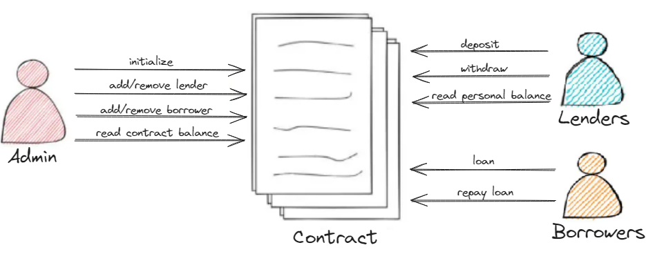

# Clear Smart Contract

Clear Smart Contract is a liquidity pool for loans with a daily fee of 1%.

## Users

There are three types of users in our contract:

- **Admin:** Manages the contract and decides who enters/exits as a lender or borrower.
- **Lenders:** Provide liquidity to the contract and withdraw their money whenever they want.
- **Borrowers:** Request loans from the contract and repay them whenever they want, knowing that the loan interest rate is 1% daily. They can only request one loan at a time.

## Contract Attributes:

#### Token:
The token to be used as the currency is USDC; this contract will not implement any other token.

#### Contributions:
We store the public key of the lenders who deposited money into the contract. If they withdraw all their money, they will be removed from the contributions but will remain available as lenders (only the admin can remove them). Their function is essential when a loan is requested to calculate their participation percentage within the contract.

#### Loan:
Created when a loan is requested, it contains information about the initial amount, the start date, and the contributions of the lenders who provided money to the contract.

## Methods:

Each method of the contract will be described as follows.
#### Initialize:
The *initialize* function sets the contract admin, the token to be used, and initializes the contract balance to 0 immediately after deployment.
Params:
- `admin`: Public key of the contract admin
- `token`: Token address (in our case, USDC).

#### Balance:
Allows the admin to read the total contract balance, the lender to read their available balance, and if the address does not match either, it indicates that it is not registered in the contract.
#### Deposit:
Exclusive to lenders, it allows them to deposit money and enter the contract contributions.
#### Withdraw:
Exclusive to lenders, it allows them to withdraw money from the contract. If their balance within the contract is 0, they will be removed from the contributions.
#### Loan:
Exclusive to borrowers. For a borrower to request a loan, the amount must be available in the contract. After this, to grant the loan, it is necessary to calculate each lender's contribution percentage and update their balance, deducting the loaned amount from the contract's total balance. Additionally, the total contract balance must be updated.
#### Repay Loan:
Exclusive to borrowers. When a borrower repays a loan, the amount to be returned to each lender is calculated based on their contribution percentage. This amount is added to their available balance in the contract. If the borrower repaid the entire loan along with the fees, they can request a new loan. Otherwise, the outstanding amount will continue to accrue fees until the full loan is paid off.
#### Add Borrower:
Exclusive to the admin, it allows adding a borrower to the contract.
#### Remove Borrower:
Exclusive to the admin, it allows removing a borrower from the contract.
#### Add Lender:
Exclusive to the admin, it allows adding a lender to the contract.
#### Remove Lender:
Exclusive to the admin, it allows removing a lender from the contract.
